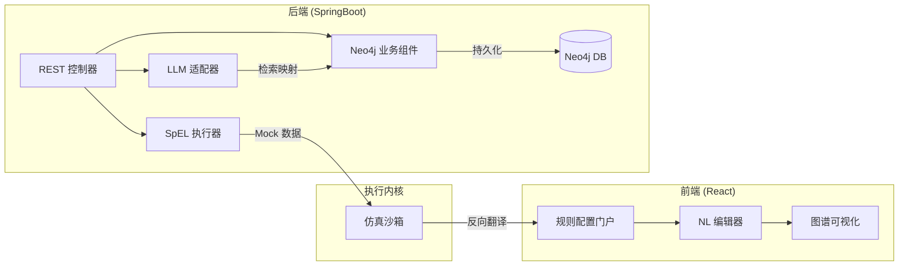

这份详细设计报告将上述方案转化为可落地执行的技术架构。我们将重点放在如何通过 **“知识图谱 + LLM”** 闭环实现自然语言到 **SpEL** 的转化。

---

## 1. 技术栈与组件版本

| 组件 | 推荐版本 | 说明 |
| --- | --- | --- |
| **前端 (React)** | 18.2.x + TailwindCSS | UI 框架，利用 Ant Design (Pro) 提高效率 |
| **后端 (SpringBoot)** | 3.2.x | 核心微服务框架，内置 SpEL 解析内核 |
| **图数据库 (Neo4j)** | 5.12.x (Community/Enterprise) | 存储本体五元组及规则关系 |
| **LLM** | GPT-4o / Claude 3.5 / DeepSeek-V3 | 负责代码解析与 NL2SpEL 生成 |


---

## 2. 功能模块与界面元素设计

### 2.1 源码知识提取模块 (Source-to-KG)

* **功能点**：上传 Java 源码，自动识别物理字段、产品 ID 及逻辑关系。
* **界面元素**：源码上传区、解析进度条、知识点预览表格（包含提取的物理 ID、业务含义、建议映射关系）。
* **接口**：`POST /api/v1/ontology/extract`

### 2.2 规则生成工作台 (NL2SpEL Workbench)

* **功能点**：自然语言输入、SpEL 实时生成、语义对齐纠错。
* **界面元素**：
* **左侧**：对话框（输入 NL 需求）。
* **中间**：SpEL 编辑器（只读，实时显示生成的代码）。
* **右侧**：本体图谱预览（显示当前需求关联的 Product 和 Metadata 节点）。


* **接口**：`POST /api/v1/rule/generate`

### 2.3 仿真验证与发布模块 (Sandbox & Deployment)

* **功能点**：构造 Mock 数据，执行 SpEL，比对预期结果。
* **界面元素**：上下文变量录入区（JSON）、运行结果面板（Pass/Fail）、日志控制台。
* **接口**：`POST /api/v1/rule/test`

---

## 3. 前后端接口交互设计 (API Contract)

### 3.1 规则生成流程

1. **Request**: `POST /api/v1/rule/generate`
```json
{
  "productId": "80000122",
  "naturalLanguage": "当业务类型是融合光网时，只准做拆机操作",
  "context": "AccessProdInst"
}

```


2. **Server Process**:
* 查询 Neo4j 获取 `80000122` 的 Metadata (col1 -> ywlx)。
* 组装 Prompt 发送给 LLM。
* 校验 SpEL 语法。


3. **Response**:
```json
{
  "spel": "#getAttr('col1') == '3' ? #serviceOfferId == '2831' : true",
  "explanation": "已识别业务类型为col1，融合光网值为3，拆机动作为2831",
  "confidence": 0.98
}

```


---

## 4. 核心提示词工程 (Prompt Engineering)

### 4.1 源码解析提示词 (Java -> KG)

> **Role**: 你是一个专家级架构师，擅长分析 BSS 系统旧代码。
> **Input**: Java 源代码。
> **Task**:
> 1. 提取所有的产品 ID 和业务操作码 (OfferId)。
> 2. 识别所有 `getAttr()` 的参数并推测其业务含义（如 col1 代表业务类型）。
> 3. 输出本体五元组 JSON：`{ "concepts": [], "relations": [], "logic": [] }`。
> 
> 

### 4.2 NL2SpEL 生成提示词 (NL + KG -> SpEL)

> **Role**: 你是一个规则引擎翻译器。
> **Context**:
> * 本体知识库：{ "col1": "业务类型", "3": "融合光网", "2831": "拆机" }
> * 当前产品：灵犀专线 (80000122)
> **Task**: 将需求“融合光网只准拆机”转化为 Spring EL。
> **Rule**:
> * 使用 `#getAttr('col1')` 获取属性。
> * 必须保证生成的表达式逻辑闭环。
> * 返回格式：`SpEL: [code]`。
> 
> 

---

## 5. 预置数据设计 (Neo4j 本体五元组)

在系统中预置以下核心模型数据：

```cypher
// 概念建模 (C)
CREATE (p:Concept {name: 'Product', desc: '业务产品'})
CREATE (m:Concept {name: 'Metadata', desc: '物理字段映射'})

// 实例数据 (I)
CREATE (lx:Product {id: '80000122', name: '灵犀专线'})
CREATE (c1:Metadata {id: 'col1', name: '业务类型', mapping: 'ywlx'})

// 关系建模 (R)
CREATE (c1)-[:BELONGS_TO]->(lx)

// 函数/算子建模 (F)
CREATE (f:Function {name: 'ipCheck', signature: '@ipUtil.isValid(#val)'})

```

---

## 6. 系统详细设计架构图



---

## 7. 关键代码片段实现 (SpringBoot)

### SpEL 解析与验证组件

```java
@Service
public class SpelValidationService {
    private final ExpressionParser parser = new SpelExpressionParser();

    public boolean validate(String spel, Map<String, Object> context) {
        try {
            StandardEvaluationContext evalContext = new StandardEvaluationContext();
            evalContext.setVariables(context);
            Expression exp = parser.parseExpression(spel);
            exp.getValue(evalContext); // 试运行
            return true;
        } catch (Exception e) {
            log.error("SpEL 语法错误: {}", e.getMessage());
            return false;
        }
    }
}

```

### Neo4j 映射查询

```java
@Repository
public interface MetadataRepository extends Neo4jRepository<MetadataEntity, String> {
    @Query("MATCH (m:Metadata)-[:BELONGS_TO]->(p:Product {id: $prodId}) RETURN m")
    List<MetadataEntity> findByProductId(String prodId);
}

```

---

### 💡 核心价值总结

该设计通过 **Neo4j 锁死物理与业务的映射关系**，防止 LLM 在生成 SpEL 时产生“幻觉”（即生成不存在的字段名）。同时，利用 React 前端将复杂的逻辑验证可视化，确保非技术人员生成的规则是**能生成、可验证、可管理**的。
